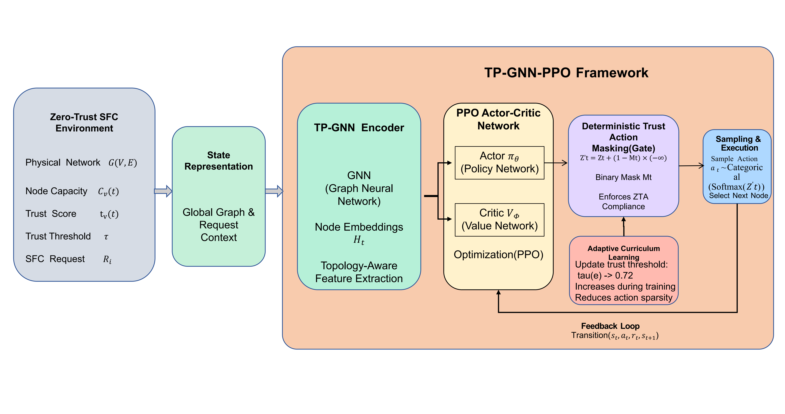

# TP-GNN-PPO: Intelligent Orchestration of Trusted Service Function Chains

[](https://opensource.org/licenses/MIT)
[](https://www.python.org/)
[](https://pytorch.org/)

Official PyTorch implementation for the paper:

**TP-GNN-PPO: Intelligent Orchestration of Trusted Service Function Chains via Topology-Aware Reinforcement Learning**

---

## 📌 Overview

Modern 5G/6G infrastructures increasingly follow **Zero-Trust Architecture (ZTA)**, where service orchestration must satisfy not only resource and QoS constraints (CPU/BW/delay), but also **dynamic trust constraints**. This repository provides **TP-GNN-PPO**, a topology-aware and security-deterministic reinforcement learning framework for trusted Service Function Chain (SFC) provisioning.

---

## ✨ Key Ideas

- **Topology-aware encoding (TP-GNN)**: a graph neural encoder captures global connectivity and resource patterns, improving feasibility under congestion.
- **Deterministic trust action masking**: filters out non-compliant actions before sampling, enforcing trust constraints at the action space.
- **Curriculum on trust threshold**: gradually tightens the trust constraint during training to reduce early instability from sparse feasible actions.

---

## 🧩 Architecture




---


## 📥 Installation
- Clone this repository to your local machine:

```bash
git clone https://github.com/tpgnnppo/tp_gnn_ppo.git
```
## ⚙️ Requirements

- Python **3.8+**
- PyTorch **1.12+** (CUDA optional)

Install common dependencies:

```bash
pip install -r requirements.txt
```

---

## 🚀 Quick Start (Run `main.py`)

Run training (default settings):

```bash
python main.py
```

Notes:

- Checkpoints will be saved under `checkpoints/` 

---

## 🧪 Evaluation & Reproducibility

To rigorously evaluate the trained models and reproduce the benchmark results (Table II, Fig. 2-4) from our paper, we provide a complete suite of evaluation scripts. All testing is conducted on a fixed topology (`topo_seed=42`) to ensure absolute reproducibility. 

All metrics (Acceptance Ratio, Delay, TrustDE, ResFail) will be automatically aggregated into `eval_results.csv` for easy analysis and plotting.

**Evaluate the Proposed Model (TP-GNN-PPO)**
To evaluate the fully trained agent under strict zero-trust constraints ($\tau=0.72$):
```bash
python evaluate.py
```


## 📄 License

This project is released under the **MIT License** (see `LICENSE`).